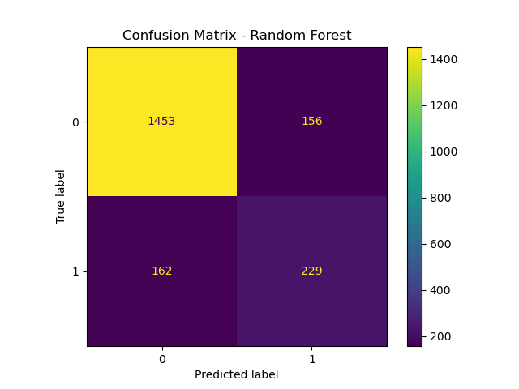
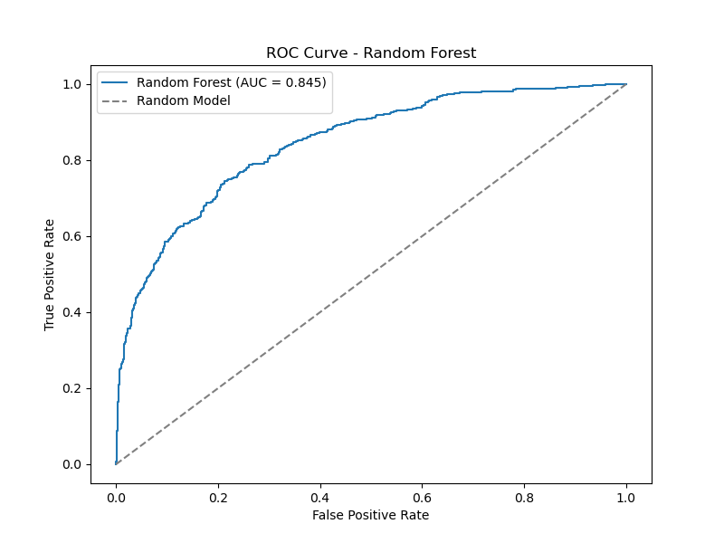
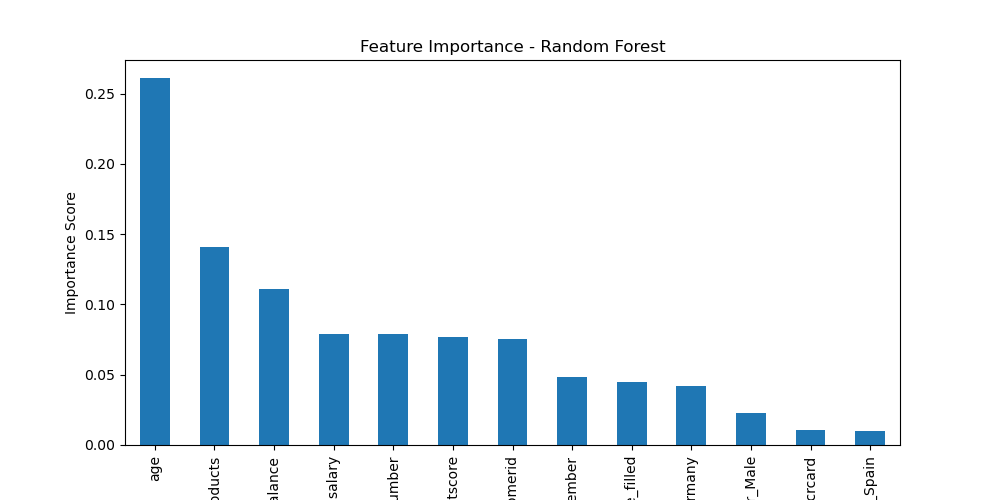

# Predicting Customer Churn at Beta Bank

## 📌 Project Overview
Beta Bank is experiencing customer churn, and reducing churn is more cost-effective than acquiring new customers. The goal of this project is to build a machine learning model that accurately predicts **which customers are likely to leave the bank**. 

To meet the project requirements, the final model needed an **F1 score of at least 0.59**, which was achieved through **hyperparameter tuning, threshold optimization, and class weighting adjustments**.

## 🚀 Key Highlights
- **Data Source**: Customer transaction and demographic data from Beta Bank
- **Machine Learning Model**: Random Forest Classifier
- **Performance Metrics**:
  - **Final F1 Score**:  0.5900  ✅ *(meets project requirement!)
  - **Final AUC-ROC Score**: 0.8517  *(shows strong class separation)*

## 📊 Data Overview
The dataset includes **customer information and banking behavior**, with features such as:
- `CreditScore`, `Age`, `Balance`
- `NumOfProducts` (Number of banking products used)
- `IsActiveMember` (Activity status)
- `EstimatedSalary`
- **Target Variable:** `Exited` (1 = Churned, 0 = Stayed)

## 🛠 Methodology & Steps
1. **Exploratory Data Analysis (EDA)**
   - Checked for missing values and anomalies
   - Examined class imbalance (churn vs. non-churn)

2. **Baseline Model & Class Imbalance Handling**
   - Trained an initial Random Forest model **without** balancing classes
   - Found that the model was biased toward predicting **non-churn** (majority class)

3. **Hyperparameter Optimization**
   - Tuned hyperparameters using **GridSearchCV** on a **Random Forest Classifier**
   - Best hyperparameters: `{n_estimators: 150, max_depth: None, min_samples_leaf: 5, min_samples_split: 2}`

4. **Threshold Optimization**
   - Instead of the default **0.5 threshold**, tested **multiple thresholds** to improve the balance between **precision and recall**
   - Best threshold: `0.62`

5. **Final Model Training**
   - Trained the best model on the **full training dataset** using the best hyperparameters
   - Adjusted `class_weight={0:1, 1:5}` to further optimize for churn prediction

6. **Model Evaluation**
   - **F1 Score improved above 0.59** 🎯
   - **AUC-ROC remained strong (~0.85)** ✅

--- 
## 📈 Model Evaluation
The **Random Forest model** was evaluated using key classification metrics:

### **Confusion Matrix**
The confusion matrix below shows the breakdown of correct and incorrect predictions:



- **True Negatives (1453)** → Correctly predicted customers who stayed.  
- **False Positives (156)** → Customers incorrectly predicted to churn.  
- **False Negatives (162)** → Customers who churned but were **not predicted to do so** (missed churn).  
- **True Positives (229)** → Customers correctly predicted to churn.  

 **Interpretation:**  
- The model correctly identifies **churners (1s) with some false negatives**, meaning some actual churn cases are still being missed.  
- Precision and recall are balanced, thanks to **class weighting and threshold tuning**.  

---

### **ROC Curve**
The **ROC Curve** shows how well the model separates churners from non-churners at different thresholds.



**Interpretation:**  
- **AUC-ROC Score: `0.8503`** → Indicates strong class separation.  
- The model **performs well** across different decision thresholds, meaning it **can confidently distinguish churners from non-churners**.  

---

### **Feature Importance**
The **most important factors** in predicting customer churn:



🔹 **Key Insights:**  
- **Top Features**: *(List top 3 from the chart, e.g., `Age`, `NumOfProducts`, `Balance`)*.  
- **Business Implication**: Customers with (e.g., higher `NumOfProducts`) may have a lower churn risk.  

---

## 🔜 Next Steps & Improvements
- **Feature Engineering**: Introduce new features (e.g., customer transaction trends)
- **Compare with Boosting Models**: Try **XGBoost** or **LightGBM** for potential improvements
- **Deploy the Model**: Create a simple API or dashboard for Beta Bank’s customer retention team

## 💡 Technologies Used
- **Python** (for data processing and modeling)
- **pandas**, **NumPy** (for data manipulation)
- **scikit-learn** (for machine learning models & evaluation)
- **Matplotlib**, **seaborn** (for data visualization)
- **GridSearchCV** (for hyperparameter tuning)
- **Models Used:**
  - **Logistic Regression** (Baseline Model)
  - **Decision Tree Classifier** (Intermediate Model)
  - **Random Forest Classifier** (Final Model)
    
---

### 📂 **How to Use This Project**
#### **1️⃣ Clone the Repository**
```sh
git clone https://github.com/yourusername/beta-bank-churn-prediction.git
cd beta-bank-churn-prediction
